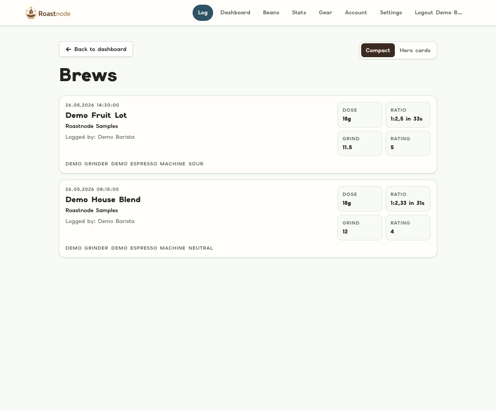
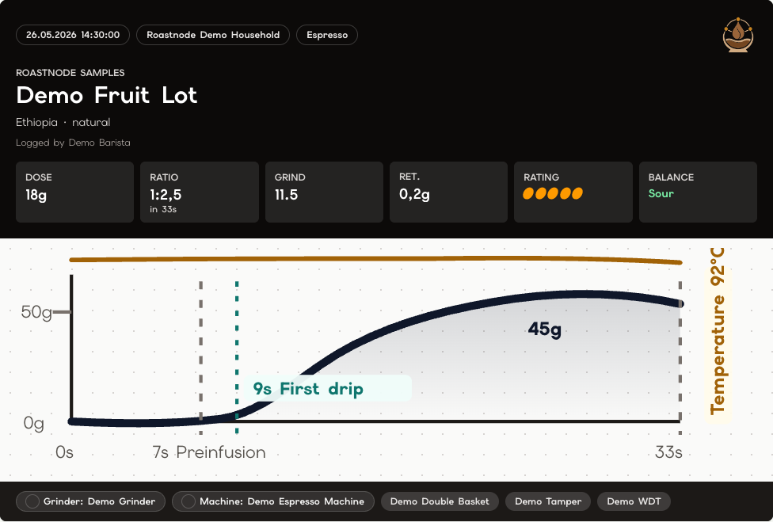
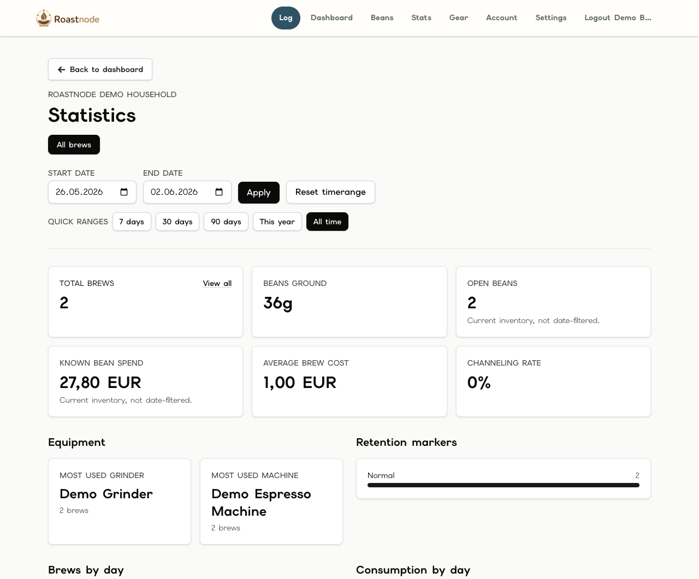

# Roastnode

<p align="center">
  
</p>

<p align="center">
  A Rails-first, self-hostable coffee tracking app for private household workspaces.
</p>

Roastnode helps shared households log espresso, track beans and gear, understand consumption, and keep coffee data private by default. It is built as a boring Rails monolith with Hotwire, Turbo, Stimulus, Tailwind CSS, PostgreSQL, Active Storage, and Solid Queue.

## Screenshots

### Brew Log

Compact brew history keeps the household's recent shots scannable: bean, roaster, barista, gear, dose, ratio, grind setting, rating, and taste balance.



### Hero Brew Card

The Hero Brew Card turns a single espresso log into a dense visual record with timestamp, household, bean details, dose, ratio, grind, retention, rating, taste balance, brew timing, temperature, and preparation tools.



### Workspace Statistics

Private workspace analytics summarize brew volume, beans ground, open inventory, known spend, average brew cost, channeling rate, equipment usage, retention markers, and day-by-day activity.



## Product Highlights

- Private household workspaces with owner, admin, member, and viewer roles.
- Espresso logging with last-brew setup defaults, draft recovery, correction-safe inventory updates, and per-user form preferences.
- Bean inventory with lifecycle states, photos, ratings, purchase data, manual adjustments, duplicate-as-new-bag, and detail analytics.
- Equipment, maintenance events, and preparation tools with media, lifecycle controls, and historical brew snapshots.
- Public brew sharing through curated snapshots, optional password gates, public notes, affiliate links, and public-media privacy boundaries.
- Workspace statistics, Beanconqueror import, owner-only exports, instance-admin backups, and production self-hosting docs.

## Quick Start

```bash
cp .env.example .env
bundle install
docker compose up -d postgres
bin/rails db:prepare
bin/dev
```

Open `http://localhost:3001`.

## Demo Data

For local exploration and screenshots:

```bash
bin/rails roastnode:demo:load
```

Demo login:

- Email: `demo@roastnode.local`
- Password: `roastnode-demo`
- Workspace: `Roastnode Demo Household`

Do not load the demo account on a hosted/public instance unless you immediately remove or change the credentials.

## Local Defaults

- Rails web port: `3001`
- Roastnode PostgreSQL host port: `5433`
- PostgreSQL container port: `5432`
- Compose image: `postgres:17.11`

The non-default host ports are intentional so Roastnode can run beside another project already using PostgreSQL on `5432`.

## Documentation

- Documentation map: `docs/README.md`
- Current status: `docs/status.md`
- Setup: `docs/setup.md`
- Production self-hosting: `docs/production-self-hosting.md`
- Public brew sharing: `docs/public-brew-sharing.md`
- Workspace core: `docs/workspace-core.md`
- Agent guidance: `AGENTS.md`

## License

Copyright (C) 2026 Roastnode contributors.

Roastnode is licensed under `AGPL-3.0-only`. See `LICENSE`.
